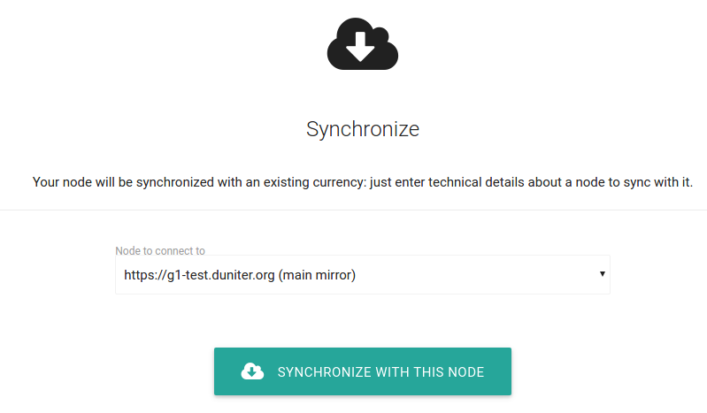

Title: Ğ1-Test : the test blockchain
Date: 2017-06-07 16:00
Category: Ğ1
Tags: Ğ1, Ğ1-Test
Slug: g1-test-restarted
Authors: cgeek
Thumbnail: images/g1-test.png

The test blockchain is **officially restarted**, the first blocks have just been calculated.

The network consists of 7 initial members, with parameters substantially equivalent to those of the *Ğ1* (/g1-go).

## How useful?

If we already have a "production" currency, the Ğ1 (pronounced "june"), then why with a second currency, the *Ğ1-Test*?

As the name suggests, the Ğ1-Test currency is made for *tests*: this is the sandbox in which we can deploy the new Duniter versions to test them, before intervening on the main network (The network Ğ1).

It would be a pity to notice that a new version would contain a major bug, and to deploy this version directly on the network Ğ1: the damage could be considerable (network inoperative, money stuck, etc.) We could have detected the problems by first going through the test currency. In addition, a new version takes time to deploy: each user needs to update their Duniter software, which can take days, weeks or months depending on the number of users.

The test network is therefore the antechamber of the main network, it is a guarantee of its stability.

This sandbox also benefits Duniter customers such as [Sakia](http://sakia-wallet.org/), [Cesium](https://github.com/duniter/cesium) or [Silkaj](https: //github.com/duniter/silkaj), which can test new features without risking users to lose their currency, or cause bugs that make the software unusable.

## Is it a currency that will grow in value?

We have chosen the parameters of Ğ1-Test **so that it takes no value, or very little**: money is created at a much higher rate than the main currency, making it possible to save minimal.

## Can I register?

Yes, and you will have much easier to sign up than on the network Ğ1: the license does not apply, you can be certified and certified in a light way without hindering anyone.

You can use Sakia or [Cesium for Ğ1-Test](https://g1-test.duniter.org/cesium).

To run Sakia on Ğ1-Test, use the command:

    sakia --currency g1-test
 
Note also that the Ğ1-Test network can be restarted from scratch if necessary.

## Is certification automatic?

No: as in Ğ1, you will have to apply for certifications from the current members of the test currency. If you do not know anyone, you can post a message on a social network like Mastodon or Diaspora* with the tag #ğ1-test to attract some certifiers. You will probably have to present yourself a minimum to convince them to certify you, it is a habit taken in previous test currencies.

And then, this prepares for the fact that certification is anything but automatic in the production network Ğ1.

## What are the currency settings?

They are roughly the same as the Ğ1, but with shorter deadlines:

```yaml
Currency: "g1-test"
C: 0.0488 # 4.88%
Dt: 86400 # of all the 24h precise
DtReeval: 631152 # DU re-evaluated every 7,305 days
Ud0: 1000 # 10.00 Ğ1
UdTime0: 1496527200 # 04 June 2017 00:00: 1st DU
UdReevalTime0: 1496570400 # 04 June 2017 12h00: 1st revaluation of the DU
SigPeriod: 86400 # 24 hours waiting time
SigStock: 100 # 100 certifications
SigWindow: 1051920 # 12,175 days
SigValidity: 12623040 # 146,1 = more than 4 months
SigQty: 5 # 5 signatures
IdtyWindow: 1051920 # 12,175 days
MsWindow: 1051920 # 12,175 days
Xpercent: 0.8 # 80%
MsValidity: 6311520 # 73,05 days
StepMax: 5 # 5 steps
MedianTimeBlocks: 24 # 24 blocks = 24/2 delay = 12 blocks = 12 * 2'30 = 30min
AvgGenTime: 150 # 2'30 "of calculation per block on average
DtDiffEval: 12 # Reassessment of difficulty every 12 blocks => 30 minutes
PercentRot: 0.67 # => 33.5% of calculators are excluded
```

## How do I add my node to the network Ğ1-Test?

[On the home page](/), click the orange "Ğ1-TEST" button to download the latest version available on this network. Then synchronize to the network:

### With Duniter Desktop:



### With Duniter Server:

    Duniter sync g1-test.duniter.org 443

See you soon on Ğ1-Test!
